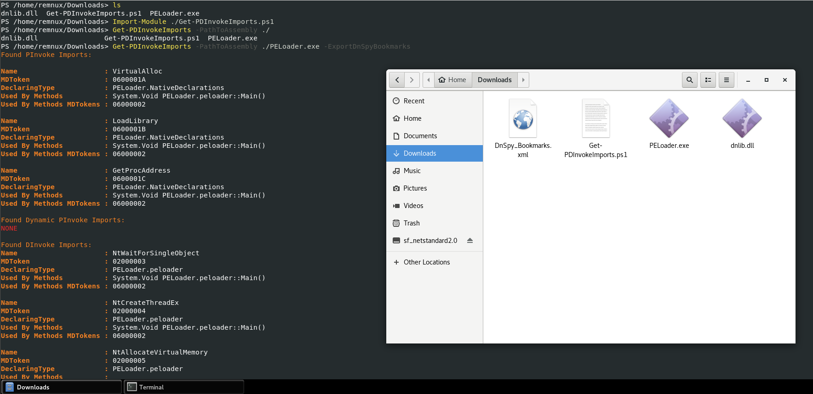
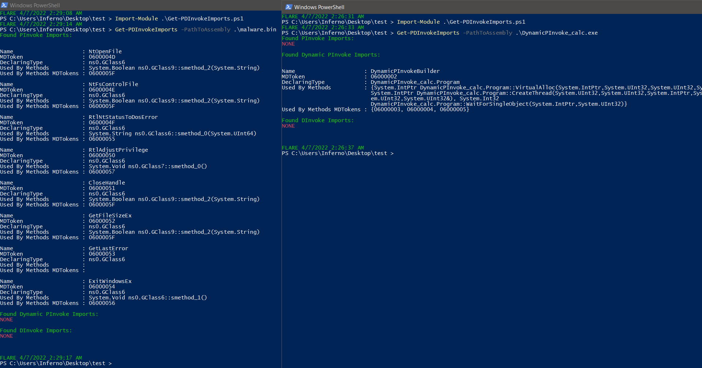
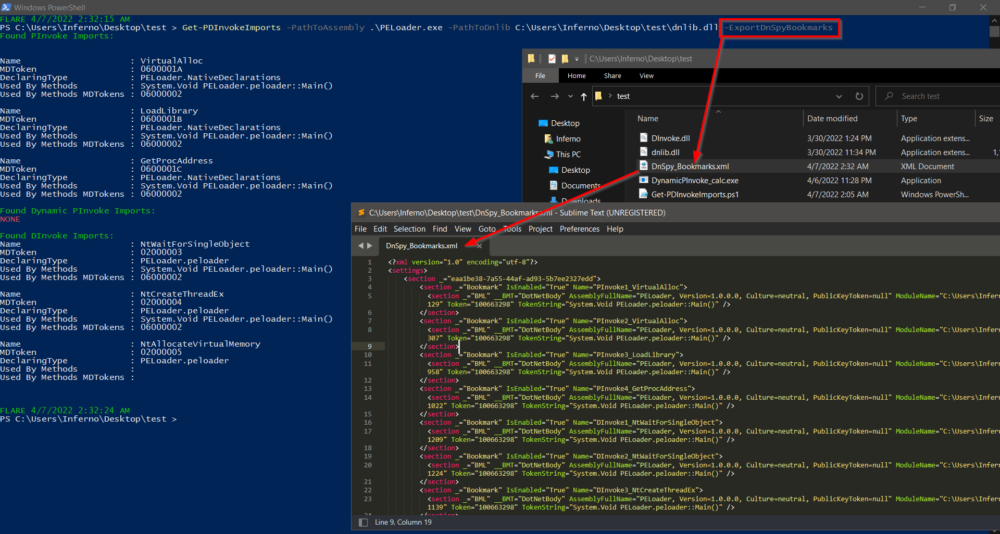
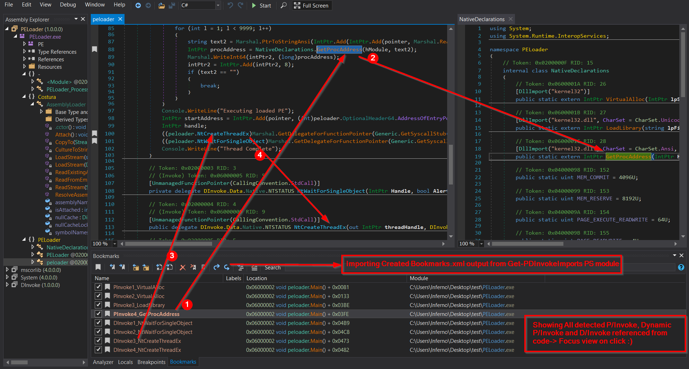

# Get-PDInvokeImports

## Description:

Get-PDInvokeImports is tool (PowerShell module) which is able to perform
automatic detection of P/Invoke, Dynamic P/Invoke and D/Invoke usage in
assembly. Showing all locations from where they are referenced and Exports all
to DnSpy_Bookmarks.xml

This PS module could be useful and helpful during reversing .NET assemblies for
fast revealing calls to unmanaged API functions used in assembly. Sometimes
malware assemblies are full of junk code where the main functionality is
implemented by direct WIN API or NTAPI calls. 
Get-PDInvokeImports enables you to get fast overview what P/Invoke, Dynamic
P/Invoke and D/Invoke are used in assembly - It will show you what functions are
used + MDTokens, where are declared, and all location where are used from code. 
It enables to export all locations where are detected P/Invoke, Dynamic P/Invoke
and D/Invoke referenced from code to DnSpy Bookmarks.xml

Example: Imagine 1MB assembly full of junk code + CF obfuscation where main
functionality is reached via unmanaged WinAPI\\NTAPI calls.

This PS module is written in PowerShell and is fully compatible with Windows
PowerShell (.NET Framework) and PowerShell Core (based on .NET, .NET Core). It uses dnlib to parse assembly and .NET reflection to load dnlib. Dnlib is
available for .NET framework and .NET standard - simply means that one can use
this PS module depending on dnlib on Windows and also Linux OS.

## What is P/Invoke, Dynamic P/Invoke and D/Invoke?

Well very briefly said these are possible implementation how one can call
unmanaged code from managed (simplified – can be used to call directly
WinAPI/NTAPI from .NET) 
Some of them are easier to implement, some of them are better avoiding AV
detection and hooking.

More information:

P/Invoke -
[[PInvoke]](https://docs.microsoft.com/en-us/dotnet/standard/native-interop/pinvoke) 
D/Invoke - [[DInvoke]](https://github.com/TheWover/DInvoke) 
Dynamic P/Invoke - [[Dynamic
PInvoke]](https://bohops.com/2022/04/02/unmanaged-code-execution-with-net-dynamic-pinvoke/) 

## Installation:

[[Releases]](https://github.com/Dump-GUY/Get-PDInvokeImports/releases) contains already compiled dnlib for specified platform + script
Get-PDInvokeImports.ps1. 
Windows – Download [[release]](https://github.com/Dump-GUY/Get-PDInvokeImports/releases) (Use from Windows PowerShell or PowerShell Core) 
Linux – Download [[release]](https://github.com/Dump-GUY/Get-PDInvokeImports/releases) (Use from PowerShell Core) 

If needed - compile dnlib on your own (Windows – .NET Framework,
Linux-netstandard) 

## Usage:

### Video: [YouTube] - In Process

### [PARAMETER] -PathToAssembly

Mandatory parameter. 
Specifies the Assembly path to scan. 

### [PARAMETER] -PathToDnlib

Optional parameter. 
System Path to dnlib.dll. 

If PowerShell is running from the location of dnlib.dll - this parameter could
be ignored otherwise specify this parameter. 

### [PARAMETER] -ExportDnSpyBookmarks

Optional parameter. 
Used to export all detected P/Invoke, Dynamic P/Invoke and D/Invoke locations
referenced from code to DnSpy Bookmarks XML file (DnSpy_Bookmarks.xml) 

Similar to DnSpy-Analyze-UsedBy (Nice overview where all PInvoke and DInvoke are
used in whole code) 

So it is possible to import it to DnSpy via Bookmarks Window (DnSpy -\> View -\>
Bookmarks -\> Bookmark Window -\> Import bookmarks from file -\> select
DnSpy_Bookmarks.xml) 

### [EXAMPLES]

~~~~~~~~~~~~~~~~~~~~~~~~~~~~~~~~~~~~~~~~~~~~~~~~~~~~~~~~~~~~~~~~~~~~~~~~~~~~~~~~
PS> Import-Module .\Get-PDInvokeImports.ps1
PS> Get-PDInvokeImports -PathToAssembly 'C:\testfiles\malware.exe'
PS> Get-PDInvokeImports -PathToAssembly .\malware.exe –ExportDnSpyBookmarks
PS> Get-PDInvokeImports -PathToAssembly 'C:\testfiles\malware.exe' -PathToDnlib "C:\dnlib.dll" –ExportDnSpyBookmarks
~~~~~~~~~~~~~~~~~~~~~~~~~~~~~~~~~~~~~~~~~~~~~~~~~~~~~~~~~~~~~~~~~~~~~~~~~~~~~~~~

## Linux Examples:

## Windows Examples:

## Remarks

Detection should be robust enough to defeat some common obfuscations.. 
Tested with most common obfuscators like SmartAssembly, ConfuserEx etc. 

Detection internals: P/Invoke is detected via PinvokeImpl attribute which has to
be always presented. 
D/Invoke is detected via "UnmanagedFunctionPointerAttribute" attribute and "CallingConvention" (This
could be defeated under certain circumstances – but I leave it for RedTeam imagination (I will beat you anyway) 
Dynamic P/Invoke detection is based on finding methodX referencing DefinePInvokeMethod() + all methodsY referencing methodX. 

## Dependecies:

[[dnlib]](https://github.com/0xd4d/dnlib) (.NET metadata reader/writer which can
also read obfuscated assemblies) 
[[DnSpyEx - optional]](https://github.com/dnSpyEx/dnSpy) 
